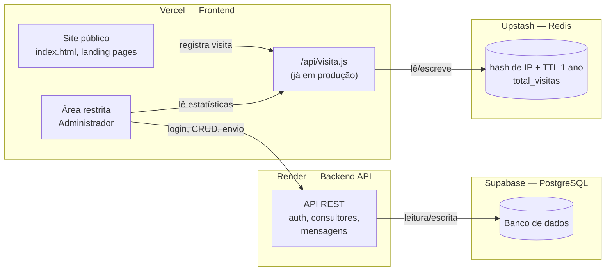

# Plano de Sprints — Área Restrita (Administrador)

**Projeto:** MC Treinamentos — site institucional
**Escopo deste documento:** construção da área restrita do **Administrador**, com o modelo de dados já preparado para suportar a futura área de **Consultores**.
**Stack definida:**

| Camada | Serviço |
|---|---|
| Frontend | Vercel |
| Backend (API) | Render |
| Banco de dados | PostgreSQL via Supabase |
| Contador de visitantes | Vercel Function + Upstash Redis (já em produção, ver Sprint 2) |

## Status atual

✅ **Contador de visitantes já está no ar** — implementado fora da ordem original deste plano, como solução enxuta e independente (Vercel Function + Upstash Redis), sem depender do Render/Supabase. Ver detalhes na nota do Sprint 2. Nenhuma outra entrega deste plano foi iniciada — Sprints 0, 1, 3, 4 e 5 seguem como planejados.

---

## 1. Arquitetura

O contador de visitantes já roda de forma independente: o site público chama `/api/visita.js` (Vercel Function), que aplica a deduplicação por IP direto no Redis do Upstash — sem passar pelo Render/Supabase. O restante (autenticação, CRUD de consultores, mensagens) segue o caminho original: a área restrita consome a API no Render, que lê/escreve no Postgres. Quando a tela **Visitantes** do painel existir, ela só precisa ler do mesmo `/api/visita.js`, não recriar essa lógica no Render.

---

## 2. Modelo de dados (visão inicial)

Desenhado desde já com a área de Consultores em mente — por isso `usuarios` já carrega um campo `role`, em vez de criar tabelas separadas que exigiriam migração depois.

| Tabela | Campos principais | Observação |
|---|---|---|
| `usuarios` | id, nome, email, senha_hash, role (`admin` \| `consultor`), status, criado_em | Login único para admin e, futuramente, consultores |
| `consultores` | id, usuario_id (FK), telefone, especialidade, status | Dados específicos de quem tem `role = consultor` |
| `mensagens` | id, remetente_id, assunto, corpo, enviado_em | Destinatários numa tabela associativa (`mensagens_destinatarios`) |
| `visit_logs` | id, ip_hash, pagina, criado_em, expira_em | `ip_hash` = SHA-256(IP + sal secreto); nunca guarda IP puro |

---

## 3. Sprints

Cada sprint assume ~1 semana de trabalho focado; ajuste conforme a disponibilidade real. A ordem respeita dependências técnicas (não dá pra ter consultores sem autenticação, nem visitantes sem backend no ar).

### Sprint 0 — Fundação técnica
**Objetivo:** ter a infraestrutura das três camadas no ar e se comunicando, antes de qualquer funcionalidade de negócio.

- Decidir se o frontend continua HTML/JS puro ou migra para um framework (ex: Next.js) — impacta como a área restrita é estruturada.
- Criar o projeto no Supabase e as tabelas iniciais (`usuarios`, `consultores`, `mensagens`, `visit_logs`).
- Criar o serviço backend no Render (esqueleto da API, variáveis de ambiente, conexão com o Postgres do Supabase).
- Conectar o repositório ao Vercel (se ainda não estiver) e ao Render, com deploy automático por push.
- Definir o contrato básico da API (rotas, formato de resposta, tratamento de erro).

**Entrega:** backend respondendo em produção (ex: rota `/health`), banco criado, frontend e backend conversando num teste simples.

---

### Sprint 1 — Autenticação e controle de acesso
**Objetivo:** substituir o login fake do protótipo por autenticação real.

- Implementar login (email + senha) no backend, com hash de senha e emissão de token (JWT ou sessão via Supabase Auth — decidir em conjunto com o Sprint 0).
- Middleware no backend que valida o token em toda rota protegida.
- Frontend: tela de login real, redirecionamento se não autenticado, logout.
- Modelar `role` (`admin`/`consultor`) desde já, mesmo com só o admin ativo por enquanto.

**Entrega:** área restrita só acessível com login válido; sessão expira corretamente.

---

### Sprint 2 — Contador de visitantes com deduplicação por IP
**Status: ✅ concluído antecipadamente, fora da ordem deste plano — arquitetura diferente da originalmente prevista.**

Em vez de esperar o Render/Supabase (Sprint 0), o contador foi implementado como peça independente, direto no Vercel:

- `api/visita.js` (Vercel Function) recebe o "hit" de visita, chamado hoje só por `index.html`.
- Hash do IP com `SHA-256(IP + VISIT_HASH_SALT)`, gravado no **Upstash Redis** (não no Postgres) com TTL de **1 ano** (não 24h — decisão tomada durante a implementação: mede "visitante único" de forma mais duradoura, não "único por dia").
- Total exibido direto no rodapé de `index.html` via `#visitor-count`.
- Expiração é automática (TTL nativo do Redis) — não precisou de rotina de limpeza própria.

**O que falta, só quando a área restrita existir:**
- Tela **Visitantes** do painel (Sprint 1+) deve **consumir esse mesmo endpoint/Redis** para exibir os números — não recriar a lógica no Render/Postgres.
- Estender o tracking (chamar `/api/visita`) para as demais páginas públicas, hoje só `index.html` dispara.
- Se quiser métricas mais ricas (hoje, últimos 7 dias, repetidas ignoradas — como no protótipo visual), precisa de chaves Redis adicionais além do contador único `total_visitas`; ainda não implementado.

---

### Sprint 3 — Cadastro de consultores (CRUD)
**Objetivo:** administrador consegue gerenciar consultores de verdade.

- Endpoints de CRUD (`criar`, `listar`, `editar`, `ativar/desativar`) na tabela `consultores` + `usuarios`.
- Validações (e-mail único, campos obrigatórios).
- Tela **Consultores** ligada à API real, substituindo os dados fictícios do protótipo.
- Geração de credencial inicial para o consultor (senha temporária ou convite) — esse fluxo já é a base do futuro login de consultor.

**Entrega:** administrador cadastra, edita e desativa consultores persistindo no banco.

---

### Sprint 4 — Mensagens para consultores
**Objetivo:** administrador consegue comunicar consultores cadastrados.

- Tabela `mensagens` + `mensagens_destinatarios`, endpoint de envio.
- Tela **Mensagens** ligada à API real: seleção de destinatários reais, histórico de envios persistido.
- Definir se o envio é só interno (visível quando o consultor logar futuramente) ou também dispara e-mail (ex: via Resend/SendGrid) — decisão de escopo, pode ficar para depois.

**Entrega:** mensagens gravadas no banco e associadas aos consultores certos, prontas para serem lidas quando a área de Consultores existir.

---

### Sprint 5 — Segurança, polimento e preparação para a área de Consultores
**Objetivo:** fechar o ciclo do Administrador com qualidade de produção e deixar o terreno pronto para o próximo projeto.

- Row Level Security (RLS) no Supabase, CORS restrito entre Vercel e Render, rate limiting básico na API.
- Sanitização de inputs em todos os formulários.
- Ajustes finais de UX com base no protótipo validado.
- Documentar o contrato de API e o modelo de dados — vira o ponto de partida da área de Consultores.

**Entrega:** área do Administrador pronta para uso real, com base técnica documentada para a próxima fase.

---

## 4. Fora de escopo (próximo projeto)

A **área de Consultores** (login do consultor, leitura de mensagens recebidas, funcionalidades próprias ainda a definir) fica para um projeto seguinte — mas o modelo de dados e a autenticação deste plano já foram desenhados para não exigir retrabalho quando ela começar.

## 5. Decisões em aberto

- Frontend continua HTML/JS puro ou migra para Next.js? (afeta o Sprint 0)
- Autenticação: JWT próprio no backend ou Supabase Auth?
- Envio de mensagem dispara e-mail de verdade ou fica só na área restrita por enquanto?

## 6. Decisões já tomadas (fora deste plano, durante a implementação do contador)

- Janela de deduplicação do contador de visitantes: **1 ano** (`VISIT_TTL_SECONDS`), não 24h.
- Armazenamento do contador: **Upstash Redis**, não Postgres — mantido como peça separada mesmo depois que o Supabase entrar em produção, por ser mais simples para essa necessidade (`INCR` atômico + TTL nativo).
- `package.json` do repositório passou a existir só por causa da dependência `@upstash/redis` das Vercel Functions — o site público continua sem build step.
