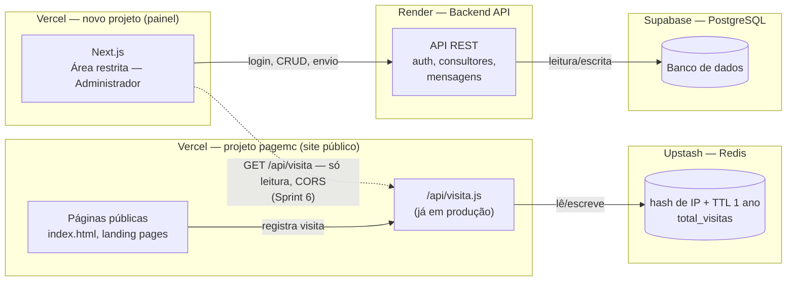

# Plano de Sprints — Área Restrita (Administrador)

**Projeto:** MC Treinamentos — site institucional
**Escopo deste documento:** construção da área restrita do **Administrador**, com o modelo de dados já preparado para suportar a futura área de **Consultores**.
**Stack definida:**

| Camada | Serviço |
|---|---|
| Frontend | Next.js, em **projeto e repositório próprios** (não o `pagemc`) |
| Backend (API) | Render |
| Banco de dados | PostgreSQL via Supabase |
| Contador de visitantes | Vercel Function + Upstash Redis, dentro do `pagemc` (já em produção, ver Sprint 2) |

## Decisão de isolamento (2026-08-14)

O `pagemc` está em produção com um evento ao vivo (landing de Liderança Sob Pressão) e **não pode sofrer risco de instabilidade**. Por isso a área restrita nasce como **projeto Vercel e repositório separados**, com domínio próprio (`painel.madalenacarvalho.com.br` ou similar) — não uma migração do site atual para Next.js.

Isso resolve, sem debate, a decisão que estava em aberto no Sprint 0: **o `pagemc` continua HTML puro, sem build step, intocado.** A única comunicação entre os dois sistemas é uma leitura HTTP pontual (Sprint 6). Diagrama da arquitetura: ["Dois Projetos, Um Elo"](https://claude.ai/code/artifact/ba2fc213-c823-4150-841a-acd3be31659c).

## Status atual

✅ **Contador de visitantes já está no ar** — implementado fora da ordem original deste plano, como solução enxuta e independente (Vercel Function + Upstash Redis), sem depender do Render/Supabase. Ver detalhes na nota do Sprint 2.

✅ **Sprint 0 concluído** (2026-08-14): repositório [`painel-mc-treinamentos`](https://github.com/crisqua/painel-mc-treinamentos) criado, tabelas no Supabase (`usuarios`, `consultores`, `mensagens`, `mensagens_destinatarios`), backend no Render respondendo em `/health`, frontend Next.js publicado em `https://painel.madalenacarvalho.com.br` (HTTPS válido), contrato de API documentado em `docs/api-contrato.md` nesse repositório.

Sprints 1, 3, 4, 5 e 6 seguem como planejados, ainda não iniciados.

---

## 1. Arquitetura

O `pagemc` (site público) e o painel da área restrita são **dois projetos Vercel separados**, com deploys e domínios independentes — não um único projeto com duas frentes. O contador de visitantes roda dentro do `pagemc`: a página chama `/api/visita.js` (Vercel Function), que aplica a deduplicação por IP direto no Redis do Upstash, sem passar pelo Render/Supabase. A área restrita segue seu próprio caminho: login, CRUD de consultores e mensagens conversam só com a API no Render, que lê/escreve no Postgres. A única aresta entre os dois projetos é tracejada no diagrama acima — a tela **Visitantes** do painel lendo `/api/visita.js` (Sprint 6), a única dependência entre os dois sistemas.

---

## 2. Modelo de dados (visão inicial)

Desenhado desde já com a área de Consultores em mente — por isso `usuarios` já carrega um campo `role`, em vez de criar tabelas separadas que exigiriam migração depois.

| Tabela | Campos principais | Observação |
|---|---|---|
| `usuarios` | id, nome, email, senha_hash, role (`admin` \| `consultor`), status, criado_em | Login único para admin e, futuramente, consultores |
| `consultores` | id, usuario_id (FK), telefone, especialidade, status | Dados específicos de quem tem `role = consultor` |
| `mensagens` | id, remetente_id, assunto, corpo, enviado_em | Destinatários numa tabela associativa (`mensagens_destinatarios`) |
| ~~`visit_logs`~~ | id, ip_hash, pagina, criado_em, expira_em | **Descartada** (Sprint 0) — o contador de visitantes ficou 100% no Redis (Sprint 2), sem tabela própria no Postgres. Não foi criada na migration inicial. |

---

## 3. Sprints

Cada sprint assume ~1 semana de trabalho focado; ajuste conforme a disponibilidade real. A ordem respeita dependências técnicas (não dá pra ter consultores sem autenticação, nem visitantes sem backend no ar).

### Sprint 0 — Fundação técnica ✅ concluído (2026-08-14)
**Objetivo:** ter a infraestrutura das três camadas no ar e se comunicando, antes de qualquer funcionalidade de negócio — **num projeto isolado do `pagemc`**.

**0.1 Repositório** ✅
- Repositório [`painel-mc-treinamentos`](https://github.com/crisqua/painel-mc-treinamentos) criado no GitHub — separado do `page_MC`, histórico e deploy próprios.
- App Next.js (App Router) na raiz.

**0.2 Banco de dados (Supabase)** ✅
- Projeto Supabase criado.
- Migration inicial rodada com as 4 tabelas (`usuarios`, `consultores`, `mensagens`, `mensagens_destinatarios`) — script em `supabase/migrations/0001_init_schema.sql` no repositório. `visit_logs`, da seção 2, ficou de fora de propósito: o contador de visitantes roda inteiramente no Redis (Sprint 2), sem tabela própria no Postgres.

**0.3 Backend (Render)** ✅
- Web Service `painel-mc-treinamentos-api` no ar no Render, Root Directory `server/`.
- Esqueleto em Express + TypeScript, rota `/health` respondendo `{"status":"ok"}` em produção.
- `DATABASE_URL` ainda não configurada — só entra no Sprint 1, quando o backend passar a consultar `usuarios`.

**0.4 Frontend (Next.js)** ✅
- `create-next-app` (TypeScript + App Router + Tailwind), publicado no Vercel.

**0.5 Domínio** ✅
- `painel.madalenacarvalho.com.br` configurado (CNAME na HomeHost, onde o domínio é gerenciado) e validado no Vercel — HTTPS respondendo 200.
- `painel-mc-treinamentos.vercel.app` mantido como redirecionamento (307) pro domínio próprio, não removido.
- Domínio raiz e `www` do `pagemc` não foram tocados.

**0.6 Contrato de API** ✅
- Documentado em `docs/api-contrato.md` no repositório: envelope `{ data, error }`, tabela de status HTTP, enum de `error.code`, convenção de rotas (`/api/v1/...`), autenticação via `Authorization: Bearer`, paginação.

**Entrega:** `GET /health` respondendo 200 em produção no Render; tabelas criadas no Supabase; Next.js publicado em `painel.madalenacarvalho.com.br` com a tela padrão; contrato de API documentado. **Nada disso tocou o repositório ou o deploy do `pagemc`.**

---

### Sprint 1 — Autenticação e controle de acesso
**Objetivo:** substituir o login fake do protótipo por autenticação real.

- Implementar login (email + senha) no backend: hash de senha com bcrypt, comparação com `usuarios.senha_hash`, emissão de JWT próprio (decisão tomada — ver seção 6).
- Middleware no backend que valida o token em toda rota protegida.
- Frontend: tela de login real, redirecionamento se não autenticado, logout.
- Modelar `role` (`admin`/`consultor`) desde já, mesmo com só o admin ativo por enquanto.

**Entrega:** área restrita só acessível com login válido; sessão expira corretamente.

---

### Sprint 2 — Contador de visitantes com deduplicação por IP
**Status: ✅ concluído antecipadamente, fora da ordem deste plano — arquitetura diferente da originalmente prevista.**

Em vez de esperar o Render/Supabase (Sprint 0), o contador foi implementado como peça independente, direto no Vercel:

- `api/visita.js` (Vercel Function) recebe o "hit" de visita, chamado hoje só por `index.html`.
- Hash do IP com `SHA-256(IP + VISIT_HASH_SALT)`, gravado no **Upstash Redis** (não no Postgres) com TTL de **1 ano** (não 24h — decisão tomada durante a implementação: mede "visitante único" de forma mais duradoura, não "único por dia").
- Total exibido direto no rodapé de `index.html` via `#visitor-count`.
- Expiração é automática (TTL nativo do Redis) — não precisou de rotina de limpeza própria.

**O que falta:** ligar a tela **Visitantes** do painel a este endpoint — ver Sprint 6, o último deste plano, feito só depois que a área restrita já existe e funciona sozinha.

Fora do escopo da área restrita (backlog do `pagemc`, independente): estender o tracking para as demais páginas públicas (hoje só `index.html` dispara `/api/visita`) e, se quiser métricas mais ricas (hoje, últimos 7 dias, repetidas ignoradas), criar chaves Redis adicionais além do contador único `total_visitas`.

---

### Sprint 3 — Cadastro de consultores (CRUD)
**Objetivo:** administrador consegue gerenciar consultores de verdade.

- Endpoints de CRUD (`criar`, `listar`, `editar`, `ativar/desativar`) na tabela `consultores` + `usuarios`.
- Validações (e-mail único, campos obrigatórios).
- Tela **Consultores** ligada à API real, substituindo os dados fictícios do protótipo.
- Geração de credencial inicial para o consultor (senha temporária ou convite) — esse fluxo já é a base do futuro login de consultor.

**Entrega:** administrador cadastra, edita e desativa consultores persistindo no banco.

---

### Sprint 4 — Mensagens para consultores
**Objetivo:** administrador consegue comunicar consultores cadastrados.

- Tabela `mensagens` + `mensagens_destinatarios`, endpoint de envio.
- Tela **Mensagens** ligada à API real: seleção de destinatários reais, histórico de envios persistido.
- Definir se o envio é só interno (visível quando o consultor logar futuramente) ou também dispara e-mail (ex: via Resend/SendGrid) — decisão de escopo, pode ficar para depois.

**Entrega:** mensagens gravadas no banco e associadas aos consultores certos, prontas para serem lidas quando a área de Consultores existir.

---

### Sprint 5 — Segurança, polimento e preparação para a área de Consultores
**Objetivo:** fechar o ciclo do Administrador com qualidade de produção e deixar o terreno pronto para o próximo projeto.

- Row Level Security (RLS) no Supabase, CORS restrito entre Vercel e Render, rate limiting básico na API.
- Sanitização de inputs em todos os formulários.
- Ajustes finais de UX com base no protótipo validado.
- Documentar o contrato de API e o modelo de dados — vira o ponto de partida da área de Consultores.

**Entrega:** área do Administrador pronta para uso real, com base técnica documentada para a próxima fase.

---

### Sprint 6 — Integração com o pagemc
**Objetivo:** ligar os dois sistemas pelo único ponto de contato previsto (tela **Visitantes**), sem criar nenhuma outra dependência entre eles. Feito por último, de propósito: só depois que a área restrita já está de pé e validada sozinha (Sprints 0–5) é que ela passa a depender de algo do `pagemc`.

- Adaptar `api/visita.js` no repositório do `pagemc`: hoje só aceita `POST` (que conta a visita); adicionar um branch de leitura (`GET`, ou uma rota nova, ex. `/api/visita?read=1`) que **só devolve `total_visitas`**, sem tocar em hash de IP nem em TTL — a leitura do painel não pode contar como visita.
- Habilitar CORS nesse endpoint **apenas** para a origem do painel (`Access-Control-Allow-Origin: https://painel.madalenacarvalho.com.br`, não `*`).
- Tela **Visitantes** no painel Next.js consome essa rota de leitura via `fetch` client-side.
- Testar os dois cenários de isolamento prometidos no diagrama: painel funcionando com `pagemc` fora do ar (só o widget de visitantes falha) e `pagemc` funcionando com o painel fora do ar (nenhum efeito).
- Deploy do ajuste em `api/visita.js` no `pagemc` — lembrar de dar `git push` nos dois remotes (`origin` e `pagemc`), conforme já documentado no `CLAUDE.md`.
- Atualizar `CLAUDE.md`/este documento com a URL final do painel e confirmar que nenhuma outra rota do `pagemc` foi exposta além da de leitura.

**Entrega:** tela Visitantes exibindo o número real, com uma única rota de leitura exposta entre os dois sistemas — todo o resto (auth, consultores, mensagens) seguindo 100% independente do `pagemc`.

---

## 4. Fora de escopo (próximo projeto)

A **área de Consultores** (login do consultor, leitura de mensagens recebidas, funcionalidades próprias ainda a definir) fica para um projeto seguinte — mas o modelo de dados e a autenticação deste plano já foram desenhados para não exigir retrabalho quando ela começar.

## 5. Decisões em aberto

- Envio de mensagem dispara e-mail de verdade ou fica só na área restrita por enquanto?

## 6. Decisões já tomadas

- Janela de deduplicação do contador de visitantes: **1 ano** (`VISIT_TTL_SECONDS`), não 24h.
- Armazenamento do contador: **Upstash Redis**, não Postgres — mantido como peça separada mesmo depois que o Supabase entrar em produção, por ser mais simples para essa necessidade (`INCR` atômico + TTL nativo).
- `package.json` do repositório do `pagemc` passou a existir só por causa da dependência `@upstash/redis` das Vercel Functions — o site público continua sem build step.
- **(2026-08-14) Área restrita nasce em repositório e projeto Vercel próprios**, não como migração do `pagemc` para Next.js — motivado pelo evento ao vivo em produção, que não pode correr risco de instabilidade. Ver nota no topo deste documento e Sprint 6.
- **(2026-08-14) Autenticação: JWT próprio no backend**, não Supabase Auth — MVP com um administrador e poucos consultores cadastrados manualmente (sem self-signup), onde o valor extra do Supabase Auth (reset de senha por e-mail, confirmação de conta) não compensa reabrir a migration da `usuarios` (que já foi criada com `senha_hash` pensando em JWT próprio). Migrar pro Supabase Auth mais tarde continua possível se a necessidade aparecer.
