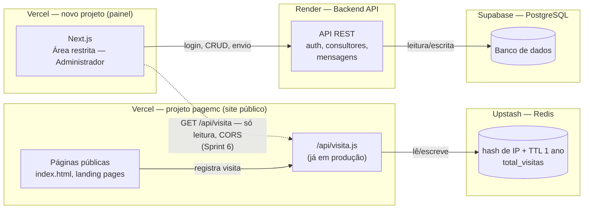

# Plano de Sprints — Área Restrita (Administrador)

**Projeto:** MC Treinamentos — site institucional
**Escopo deste documento:** construção da área restrita do **Administrador**, com o modelo de dados já preparado para suportar a futura área de **Consultores**.
**Stack definida:**

| Camada | Serviço |
|---|---|
| Frontend | Next.js, em **projeto e repositório próprios** (não o `pagemc`) |
| Backend (API) | Render |
| Banco de dados | PostgreSQL via Supabase |
| Contador de visitantes | Vercel Function + Upstash Redis, dentro do `pagemc` (já em produção, ver Sprint 2) |

## Decisão de isolamento (2026-08-14)

O `pagemc` está em produção com um evento ao vivo (landing de Liderança Sob Pressão) e **não pode sofrer risco de instabilidade**. Por isso a área restrita nasce como **projeto Vercel e repositório separados**, com domínio próprio (`painel.madalenacarvalho.com.br` ou similar) — não uma migração do site atual para Next.js.

Isso resolve, sem debate, a decisão que estava em aberto no Sprint 0: **o `pagemc` continua HTML puro, sem build step, intocado.** A única comunicação entre os dois sistemas é uma leitura HTTP pontual (Sprint 6). Diagrama da arquitetura: ["Dois Projetos, Um Elo"](https://claude.ai/code/artifact/ba2fc213-c823-4150-841a-acd3be31659c).

## Status atual

✅ **Contador de visitantes já está no ar** — implementado fora da ordem original deste plano, como solução enxuta e independente (Vercel Function + Upstash Redis), sem depender do Render/Supabase. Ver detalhes na nota do Sprint 2.

✅ **Sprint 0 concluído** (2026-08-14): repositório [`painel-mc-treinamentos`](https://github.com/crisqua/painel-mc-treinamentos) criado, tabelas no Supabase (`usuarios`, `consultores`, `mensagens`, `mensagens_destinatarios`), backend no Render respondendo em `/health`, frontend Next.js publicado em `https://painel.madalenacarvalho.com.br` (HTTPS válido), contrato de API documentado em `docs/api-contrato.md` nesse repositório.

✅ **Sprint 1 concluído** (2026-08-14): login com bcrypt + JWT próprio no backend, cookie httpOnly setado por rota do Next.js (`/api/auth/login`), `proxy.ts` bloqueando `/painel/*` sem sessão válida. Primeiro admin cadastrado direto no Supabase via SQL.

✅ **Sprint 3 concluído** (2026-08-16): CRUD de consultores completo (criar, listar, editar, ativar/desativar), protegido por `requireAdmin`. Telas `/painel/consultores` no ar, ligadas à API real via Route Handlers do Next.js. Validado em produção, incluindo login do consultor recém-criado e bloqueio de acesso ao CRUD por role.

✅ **Sprint 4 concluído** (2026-08-17): envio de mensagens pra consultores (ativos ou inativos), histórico com contagem de destinatários. Tela `/painel/mensagens` no ar. Validado em produção ponta a ponta (backend direto e cadeia completa via Route Handler).

✅ **Sprint 5 concluído** (2026-08-17): rate limiting, hardening de input, visual do `admin-prototipo.html` aplicado (login, sidebar, consultores, mensagens), `docs/api-contrato.md` atualizado com os endpoints reais. Dois bugs reais encontrados e corrigidos em teste manual — ver detalhes na seção do sprint.

Sprint 6 segue como planejado, ainda não iniciado.

---

## 1. Arquitetura

O `pagemc` (site público) e o painel da área restrita são **dois projetos Vercel separados**, com deploys e domínios independentes — não um único projeto com duas frentes. O contador de visitantes roda dentro do `pagemc`: a página chama `/api/visita.js` (Vercel Function), que aplica a deduplicação por IP direto no Redis do Upstash, sem passar pelo Render/Supabase. A área restrita segue seu próprio caminho: login, CRUD de consultores e mensagens conversam só com a API no Render, que lê/escreve no Postgres. A única aresta entre os dois projetos é tracejada no diagrama acima — a tela **Visitantes** do painel lendo `/api/visita.js` (Sprint 6), a única dependência entre os dois sistemas.

---

## 2. Modelo de dados (visão inicial)

Desenhado desde já com a área de Consultores em mente — por isso `usuarios` já carrega um campo `role`, em vez de criar tabelas separadas que exigiriam migração depois.

| Tabela | Campos principais | Observação |
|---|---|---|
| `usuarios` | id, nome, email, senha_hash, role (`admin` \| `consultor`), status, criado_em | Login único para admin e, futuramente, consultores |
| `consultores` | id, usuario_id (FK), telefone, especialidade, status | Dados específicos de quem tem `role = consultor` |
| `mensagens` | id, remetente_id, assunto, corpo, enviado_em | Destinatários numa tabela associativa (`mensagens_destinatarios`) |
| ~~`visit_logs`~~ | id, ip_hash, pagina, criado_em, expira_em | **Descartada** (Sprint 0) — o contador de visitantes ficou 100% no Redis (Sprint 2), sem tabela própria no Postgres. Não foi criada na migration inicial. |

---

## 3. Sprints

Cada sprint assume ~1 semana de trabalho focado; ajuste conforme a disponibilidade real. A ordem respeita dependências técnicas (não dá pra ter consultores sem autenticação, nem visitantes sem backend no ar).

### Sprint 0 — Fundação técnica ✅ concluído (2026-08-14)
**Objetivo:** ter a infraestrutura das três camadas no ar e se comunicando, antes de qualquer funcionalidade de negócio — **num projeto isolado do `pagemc`**.

**0.1 Repositório** ✅
- Repositório [`painel-mc-treinamentos`](https://github.com/crisqua/painel-mc-treinamentos) criado no GitHub — separado do `page_MC`, histórico e deploy próprios.
- App Next.js (App Router) na raiz.

**0.2 Banco de dados (Supabase)** ✅
- Projeto Supabase criado.
- Migration inicial rodada com as 4 tabelas (`usuarios`, `consultores`, `mensagens`, `mensagens_destinatarios`) — script em `supabase/migrations/0001_init_schema.sql` no repositório. `visit_logs`, da seção 2, ficou de fora de propósito: o contador de visitantes roda inteiramente no Redis (Sprint 2), sem tabela própria no Postgres.

**0.3 Backend (Render)** ✅
- Web Service `painel-mc-treinamentos-api` no ar no Render, Root Directory `server/`.
- Esqueleto em Express + TypeScript, rota `/health` respondendo `{"status":"ok"}` em produção.
- `DATABASE_URL` ainda não configurada — só entra no Sprint 1, quando o backend passar a consultar `usuarios`.

**0.4 Frontend (Next.js)** ✅
- `create-next-app` (TypeScript + App Router + Tailwind), publicado no Vercel.

**0.5 Domínio** ✅
- `painel.madalenacarvalho.com.br` configurado (CNAME na HomeHost, onde o domínio é gerenciado) e validado no Vercel — HTTPS respondendo 200.
- `painel-mc-treinamentos.vercel.app` mantido como redirecionamento (307) pro domínio próprio, não removido.
- Domínio raiz e `www` do `pagemc` não foram tocados.

**0.6 Contrato de API** ✅
- Documentado em `docs/api-contrato.md` no repositório: envelope `{ data, error }`, tabela de status HTTP, enum de `error.code`, convenção de rotas (`/api/v1/...`), autenticação via `Authorization: Bearer`, paginação.

**Entrega:** `GET /health` respondendo 200 em produção no Render; tabelas criadas no Supabase; Next.js publicado em `painel.madalenacarvalho.com.br` com a tela padrão; contrato de API documentado. **Nada disso tocou o repositório ou o deploy do `pagemc`.**

---

### Sprint 1 — Autenticação e controle de acesso ✅ concluído (2026-08-14)
**Objetivo:** substituir o login fake do protótipo por autenticação real.

**Decisões de desenho:**
- **JWT em cookie httpOnly**, não `localStorage` — o Next.js atua como intermediário (BFF): o form de login manda pra uma rota própria do Next.js, que chama o backend no Render server-a-server e devolve o token dentro de um cookie que o JavaScript do navegador nunca enxerga (proteção contra roubo de token via XSS).
- Como o navegador nunca chama o Render diretamente, **não precisa de CORS entre Vercel e Render neste sprint** — a única exceção de CORS do projeto continua sendo a do Sprint 6, isolada.

**Backend (`server/`):**
- `server/package.json` — adiciona `pg`, `bcryptjs`, `jsonwebtoken`, `dotenv` (dev)
- `server/.env.example` — documenta `DATABASE_URL` e `JWT_SECRET`, sem valores reais
- `server/src/db.ts` — pool de conexão Postgres
- `server/src/lib/password.ts` — hash/compare com bcrypt
- `server/src/lib/jwt.ts` — assina/verifica token (expiração: 8h)
- `server/src/lib/response.ts` — helpers `ok(data)` / `fail(code, message)`, implementa o envelope de `docs/api-contrato.md`
- `server/src/middleware/authGuard.ts` — valida `Authorization: Bearer`, popula `req.user`
- `server/src/routes/auth.ts` — `POST /api/v1/auth/login`, `POST /api/v1/auth/logout`
- `server/src/routes/me.ts` — `GET /api/v1/me`, rota protegida de teste
- `server/src/index.ts` — monta os routers acima sob `/api/v1`
- `server/src/scripts/seed-admin.ts` — cria o primeiro admin (necessário: o cadastro de usuário só existe a partir do Sprint 3)

**Frontend (raiz do repositório):**
- `package.json` — adiciona `jose` (verificação de JWT compatível com Edge Middleware)
- `.env.local.example` — documenta `API_URL` (URL do backend no Render)
- `src/lib/session.ts` — lê/valida o cookie de sessão no servidor
- `src/app/api/auth/login/route.ts` — recebe o form, chama o backend, seta o cookie httpOnly
- `src/app/api/auth/logout/route.ts` — limpa o cookie
- `src/app/login/page.tsx` — formulário de login
- `src/app/painel/layout.tsx` — layout protegido, com botão de logout
- `src/app/painel/page.tsx` — placeholder pós-login, só prova que a autenticação funciona
- `src/middleware.ts` — redireciona pra `/login` quem acessar `/painel/*` sem cookie válido

`role` (`admin`/`consultor`) já existe na tabela `usuarios` desde a 0.2 — este sprint só passa a usá-la nas respostas de login/`/me`, sem criar nada novo no schema.

**Validação:** seed do admin → `POST /api/v1/auth/login` via curl → `GET /api/v1/me` com e sem token → fluxo completo no navegador (login → `/painel` acessível → logout → `/painel` bloqueado de novo).

**Entrega:** área restrita só acessível com login válido; sessão expira em 8h. Validado em produção: login retorna cookie httpOnly, `/painel` mostra os dados do admin logado, acesso sem cookie redireciona (307) pra `/login`. Primeiro admin (`admin@mctreinamentos.com.br`) já cadastrado via SQL direto no Supabase.

---

### Sprint 2 — Contador de visitantes com deduplicação por IP
**Status: ✅ concluído antecipadamente, fora da ordem deste plano — arquitetura diferente da originalmente prevista.**

Em vez de esperar o Render/Supabase (Sprint 0), o contador foi implementado como peça independente, direto no Vercel:

- `api/visita.js` (Vercel Function) recebe o "hit" de visita, chamado hoje só por `index.html`.
- Hash do IP com `SHA-256(IP + VISIT_HASH_SALT)`, gravado no **Upstash Redis** (não no Postgres) com TTL de **1 ano** (não 24h — decisão tomada durante a implementação: mede "visitante único" de forma mais duradoura, não "único por dia").
- Total exibido direto no rodapé de `index.html` via `#visitor-count`.
- Expiração é automática (TTL nativo do Redis) — não precisou de rotina de limpeza própria.

**O que falta:** ligar a tela **Visitantes** do painel a este endpoint — ver Sprint 6, o último deste plano, feito só depois que a área restrita já existe e funciona sozinha.

Fora do escopo da área restrita (backlog do `pagemc`, independente): estender o tracking para as demais páginas públicas (hoje só `index.html` dispara `/api/visita`) e, se quiser métricas mais ricas (hoje, últimos 7 dias, repetidas ignoradas), criar chaves Redis adicionais além do contador único `total_visitas`.

---

### Sprint 3 — Cadastro de consultores (CRUD) ✅ concluído (2026-08-16)
**Objetivo:** administrador consegue gerenciar consultores de verdade.

**Referência visual:** protótipo `admin-prototipo.html` (raiz deste repositório), aba "Consultores" — layout aprovado, é o alvo real desta sprint (formulário nome/email/telefone/especialidade + tabela com badge de status e ações editar/desativar).

**Decisões de desenho:**
- CRUD fica atrás do `authGuard` (Sprint 1) + um novo `requireAdmin` — consultor não pode gerenciar outro consultor.
- Criar consultor grava em duas tabelas (`usuarios` com `role='consultor'`, depois `consultores` com o `usuario_id`) — precisa de transação no `pg` para não deixar registro órfão se uma escrita falhar.
- Sem envio de e-mail nesta sprint: o admin define a senha temporária na hora do cadastro (mesma lógica do `seed-admin.ts` do Sprint 1). Convite por e-mail é a decisão em aberto da seção 5.

**Backend (`server/`):**
- `server/src/middleware/requireAdmin.ts` — garante `req.user.role === 'admin'`, roda depois do `authGuard`
- `server/src/lib/validation.ts` — validação de e-mail/campos obrigatórios
- `server/src/routes/consultores.ts` — `GET /`, `POST /`, `GET /:id`, `PUT /:id`, `PATCH /:id/status` (ativar/desativar)
- `server/src/index.ts` — monta `/api/v1/consultores` com `authGuard` + `requireAdmin`

**Frontend (raiz do repositório):**
- `src/lib/api.ts` — helper de fetch pro backend, repassando o cookie de sessão
- `src/app/painel/consultores/page.tsx` — lista (tabela: nome, email, telefone, especialidade, status)
- `src/app/painel/consultores/novo/page.tsx` — formulário de cadastro + senha temporária
- `src/app/painel/consultores/[id]/page.tsx` — editar consultor + ativar/desativar
- `src/app/painel/layout.tsx` — adiciona link "Consultores" na navegação

**Validação:** criar consultor via curl no backend → listar → editar → desativar → confirmar que login do consultor recém-criado funciona (reusa `/api/v1/auth/login` do Sprint 1) → repetir tudo pelo navegador.

**Entrega:** administrador cadastra, edita e desativa consultores persistindo no banco. Validado em produção ponta a ponta: criação/edição/ativação via curl direto no Render, via Route Handler do Next.js (cadeia completa navegador → BFF → backend → Postgres), consultor recém-criado consegue logar (reusa o Sprint 1) e recebe 403 ao tentar acessar `/api/v1/consultores` (role `consultor` bloqueada pelo `requireAdmin`, só `admin` passa).

---

### Sprint 4 — Mensagens para consultores ✅ concluído (2026-08-17)
**Objetivo:** administrador consegue comunicar consultores cadastrados.

**Referência visual:** protótipo `admin-prototipo.html`, aba "Mensagens" — formulário (checklist de destinatários + assunto + corpo) e histórico de envios na mesma tela, sem navegação entre elas.

**Decisões de desenho:**
- Só admin envia (reusa `authGuard` + `requireAdmin`, mesmo padrão do Sprint 3).
- Envio grava em transação: `mensagens` (assunto, corpo, `remetente_id` = admin logado) + `mensagens_destinatarios` (uma linha por consultor selecionado).
- **Sem envio de e-mail nesta sprint** — mensagem fica só registrada no banco, pronta pra ser lida quando a área de Consultores existir. Decisão de e-mail real continua em aberto (seção 5).
- Sem edição/exclusão de mensagem — é um "enviar", não um documento editável.
- ~~Destinatários: qualquer consultor cadastrado, ativo ou inativo~~ — **revisto em 2026-08-17**: só consultor **ativo** pode receber mensagem (validado no backend). Inativo aparece na lista com checkbox desabilitado, não desaparece. Adicionado também "selecionar todos os consultores ativos" — o teto de 200 destinatários por envio (Sprint 5) já cobre esse cenário sem precisar de limite à parte.

**Backend (`server/`):**
- `server/src/routes/mensagens.ts` — `POST /` (cria mensagem + destinatários em transação), `GET /` (histórico: assunto, contagem de destinatários, enviado_em)
- `server/src/index.ts` — monta `/api/v1/mensagens` com `authGuard` + `requireAdmin`

**Frontend (raiz do repositório):**
- `src/app/api/mensagens/route.ts` — Route Handler `POST`, repassa cookie → backend
- `src/app/painel/mensagens/page.tsx` — Server Component: busca consultores (pro checklist) + histórico, renderiza os dois
- `src/app/painel/mensagens/message-form.tsx` — form client-side, `router.refresh()` após enviar
- `src/app/painel/layout.tsx` — adiciona link "Mensagens" na navegação

**Validação:** enviar mensagem via curl (2 destinatários) → confirmar as linhas em `mensagens_destinatarios` → listar histórico → repetir pelo navegador → conferir validação sem destinatário selecionado.

**Entrega:** mensagens gravadas no banco e associadas aos consultores certos, prontas para serem lidas quando a área de Consultores existir. Validado em produção ponta a ponta: envio via curl direto no Render, via Route Handler do Next.js, histórico com contagem correta de destinatários, e rejeição de destinatário inexistente (400).

---

### Sprint 5 — Segurança, polimento e preparação para a área de Consultores ✅ concluído (2026-08-17)
**Objetivo:** fechar o ciclo do Administrador com qualidade de produção e deixar o terreno pronto para o próximo projeto.

**Decisões de escopo (2026-08-17), revisando os itens originais à luz da arquitetura já construída:**
- ~~RLS no Supabase~~ — **superado pela arquitetura**: o backend conecta no Postgres com a connection string direta (papel `postgres`), controle de acesso é feito por `authGuard`/`requireAdmin` na API, não por RLS nas tabelas. RLS não teria efeito nessa conexão.
- ~~CORS restrito entre Vercel e Render~~ — **superado pela arquitetura**: o navegador nunca chama o Render direto (tudo via BFF do Next.js), não existe CORS a restringir hoje. Continua valendo só a exceção pontual do Sprint 6.
- Rate limiting básico na API — mantido, principalmente em `/api/v1/auth/login`.
- Sanitização/hardening de input — mantido: SQL injection já coberto (queries parametrizadas), falta limite de tamanho nos campos de texto.
- Ajustes de UX com base no protótipo validado — mantido, escopo: re-skin das telas já existentes (login, layout do painel, consultores, mensagens) pro tema do `admin-prototipo.html`. Não inclui construir a tela "Visão Geral" (fora de qualquer sprint planejado).
- Documentar o contrato de API — mantido, atualizar `docs/api-contrato.md` com os endpoints reais construídos.

**Backend (`server/`):**
- `server/package.json` — adiciona `express-rate-limit`
- `server/src/middleware/rateLimit.ts` — limiter restrito pro login, mais permissivo pro resto
- `server/src/index.ts` — aplica o limiter
- `server/src/lib/validation.ts` — limites de tamanho (nome, assunto, corpo, etc.)
- `server/src/routes/auth.ts`, `consultores.ts`, `mensagens.ts` — aplicam os novos limites

**Frontend (visual, baseado no `admin-prototipo.html`):**
- `src/app/globals.css` — paleta do protótipo (dark, laranja/dourado)
- `src/app/layout.tsx` — troca Geist por Cormorant Garamond + Barlow
- `src/app/login/page.tsx` — restyle
- `src/app/painel/layout.tsx` — vira sidebar (hoje é nav horizontal)
- `src/app/painel/consultores/*`, `src/app/painel/mensagens/*` — restyle dos cards/tabelas/forms

**Docs:**
- `docs/api-contrato.md` — lista real de endpoints (`/auth`, `/me`, `/consultores`, `/mensagens`)

**Validação:** rate limit (várias tentativas de login erradas → bloqueio temporário), campo com texto absurdamente longo → erro de validação, visual conferido nas 4 telas no navegador.

**Bugs reais encontrados e corrigidos durante a validação (não previstos no plano):**
- **`trust proxy` errado no Express.** `trust proxy: 1` pegava um IP interno instável da infraestrutura do Render (varia por requisição) em vez do IP real do cliente, fazendo o rate limit nunca acumular (cada requisição caía num "balde" diferente). Confirmado em produção pelo header `ratelimit-remaining` pulando sem sequência lógica entre chamadas seguidas do mesmo cliente. Corrigido pra `trust proxy: true`.
- **Bug de UX na tela de Mensagens** (não travava o envio, mas mostrava erro falso): o form guardava `event.currentTarget` pra chamar `.reset()` depois de um `await fetch(...)`, mas o React esvazia essa referência assim que o evento termina de ser processado — a mensagem era enviada com sucesso, mas a chamada a `.reset()` quebrava e caía no `catch`, mostrando "Não foi possível conectar" mesmo com o envio já concluído. Confirmado comparando o histórico de envios (mensagem lá) com o Network tab do navegador (resposta 201 de sucesso) enquanto a tela mostrava erro. Corrigido guardando a referência do form antes do `await`.

Também aproveitado, fora do escopo original mas de baixo risco: raiz (`/`) redireciona pro painel em vez de mostrar o scaffold padrão do Next.js; telefone formatado como `(99) 99999-9999` (máscara ao digitar + normalização na exibição, mesmo pra dados antigos sem formatação).

**Entrega:** área do Administrador pronta para uso real, com base técnica documentada para a próxima fase.

---

### Sprint 6 — Integração com o pagemc
**Objetivo:** ligar os dois sistemas pelo único ponto de contato previsto (tela **Visitantes**), sem criar nenhuma outra dependência entre eles. Feito por último, de propósito: só depois que a área restrita já está de pé e validada sozinha (Sprints 0–5) é que ela passa a depender de algo do `pagemc`.

- Adaptar `api/visita.js` no repositório do `pagemc`: hoje só aceita `POST` (que conta a visita); adicionar um branch de leitura (`GET`, ou uma rota nova, ex. `/api/visita?read=1`) que **só devolve `total_visitas`**, sem tocar em hash de IP nem em TTL — a leitura do painel não pode contar como visita.
- Habilitar CORS nesse endpoint **apenas** para a origem do painel (`Access-Control-Allow-Origin: https://painel.madalenacarvalho.com.br`, não `*`).
- Tela **Visitantes** no painel Next.js consome essa rota de leitura via `fetch` client-side.
- Testar os dois cenários de isolamento prometidos no diagrama: painel funcionando com `pagemc` fora do ar (só o widget de visitantes falha) e `pagemc` funcionando com o painel fora do ar (nenhum efeito).
- Deploy do ajuste em `api/visita.js` no `pagemc` — lembrar de dar `git push` nos dois remotes (`origin` e `pagemc`), conforme já documentado no `CLAUDE.md`.
- Atualizar `CLAUDE.md`/este documento com a URL final do painel e confirmar que nenhuma outra rota do `pagemc` foi exposta além da de leitura.

**Entrega:** tela Visitantes exibindo o número real, com uma única rota de leitura exposta entre os dois sistemas — todo o resto (auth, consultores, mensagens) seguindo 100% independente do `pagemc`.

---

## 4. Fora de escopo (próximo projeto)

A **área de Consultores** (login do consultor, leitura de mensagens recebidas, funcionalidades próprias ainda a definir) fica para um projeto seguinte — mas o modelo de dados e a autenticação deste plano já foram desenhados para não exigir retrabalho quando ela começar.

## 5. Decisões em aberto

- Envio de mensagem dispara e-mail de verdade ou fica só na área restrita por enquanto?

## 6. Decisões já tomadas

- Janela de deduplicação do contador de visitantes: **1 ano** (`VISIT_TTL_SECONDS`), não 24h.
- Armazenamento do contador: **Upstash Redis**, não Postgres — mantido como peça separada mesmo depois que o Supabase entrar em produção, por ser mais simples para essa necessidade (`INCR` atômico + TTL nativo).
- `package.json` do repositório do `pagemc` passou a existir só por causa da dependência `@upstash/redis` das Vercel Functions — o site público continua sem build step.
- **(2026-08-14) Área restrita nasce em repositório e projeto Vercel próprios**, não como migração do `pagemc` para Next.js — motivado pelo evento ao vivo em produção, que não pode correr risco de instabilidade. Ver nota no topo deste documento e Sprint 6.
- **(2026-08-14) Autenticação: JWT próprio no backend**, não Supabase Auth — MVP com um administrador e poucos consultores cadastrados manualmente (sem self-signup), onde o valor extra do Supabase Auth (reset de senha por e-mail, confirmação de conta) não compensa reabrir a migration da `usuarios` (que já foi criada com `senha_hash` pensando em JWT próprio). Migrar pro Supabase Auth mais tarde continua possível se a necessidade aparecer.
